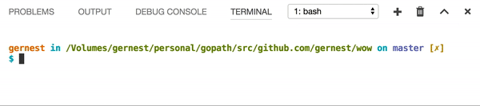

## wow

Beautiful spinners for Go commandline apps



## Install
    go get -u github.com/gernest/wow

## Usage

```go
package main

import (
	"os"
	"time"

	"github.com/gernest/wow"
	"github.com/gernest/wow/spin"
)

func main() {
	w := wow.New(os.Stdout, spin.Get(spin.Dots), "Such Spins")
	w.Start()
	time.Sleep(2 * time.Second)
	w.Text("Very emojis").Spinner(spin.Get(spin.Hearts))
	time.Sleep(2 * time.Second)
	w.PersistWith(spin.Spinner{Frames: []string{"👍"}}, " Wow!")
}
```

## Available spinners

```
၀ toggle6
(●     ) bouncingBall
  balloon
⊷ toggle
☖ toggle12
⠋ dots5
⠁ dots6
⠈ dots7
▃ growVertical
░ noise
◌ toggle8
    simpleDots
▄ boxBounce2
◟ arc
[=   ] bouncingBar
🎄 christmas
╪ squish
◥ triangle
▹▹▹▹▸ arrow3
❤️  hearts
🌏  earth
b dqpb
- line2
◱ squareCorners
■ toggle3
▯ toggle5
🙊  monkey
🕚  clock
▐/|____________▌ shark
☀️  weather
⣷ dots2
⠓ dots3
⠀⡀ dots12
◒ circleHalves
↙ arrow
🌘  moon
_ flip
☴ hamburger
⠂ bounce
◠ circle
◎ toggle9
- toggle13
㊁ toggle10
🏃  runner
⡏ dots9
/ line
✷ star
◵ circleQuarters
↖️  arrow2
😝  smiley
⠏ dots
⠆ dots4
┐ pipe
. balloon2
⡠ dots10
⠈ dots11
    simpleDotsScrolling
▗ boxBounce
▫ toggle4
⠈ dots8
▪ toggle2
⦿ toggle7
⧆ toggle11
▐⠠       ▌ pong
* star2
▎ growHorizontal
```
